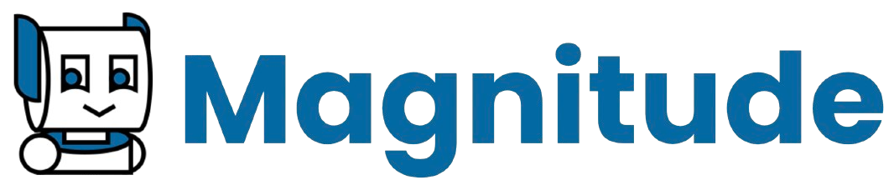

<div align="center">
  
</div>

<h1 align="center">
  The AI browser automation framework
</h1>

<p align="center">
  Magnitude uses vision AI to enable you to control your browser with natural language
</p>

<p align="center">
  <a href="https://docs.magnitude.run/getting-started/introduction" target="_blank"></a>  <a href="https://discord.gg/VcdpMh9tTy" target="_blank"></a> <a href="https://x.com/tgrnwld" target="_blank"></a>
</p>

<hr style="height: 1px; border: none; background-color: #e1e4e8; margin: 24px 0;">

- 🧭 **Navigate** - Sees and understands any interface to plan out actions
- 🖱️ **Interact** - Executes precise actions using mouse and keyboard
- 🔍 **Extract** - Intelligently extracts useful structured data
- ✅ **Verify** - Built-in test runner with powerful visual assertions


↕️ Magnitude in action! ↕️
```ts
// Magnitude can handle high-level tasks
await agent.act("Create a task", {
  // Optionally pass data that the agent will use where appropriate
  data: {
    title: "Use Magnitude",
    description: 'Run "npx create-magnitude-app" and follow the instructions',
  },
});

// It can also handle low-level actions
await agent.act('Drag "Use Magnitude" to the top of the in progress column');

// Intelligently extract data based on the DOM content matching a provided zod schema
const numTasks = await agent.extract(
  "Extract the following information for the in progress tasks",
  z.object({
    numTasks: z.number(),
    taskNames: z.array(z.string()),
  }),
);
```

## Get started

### Running your first browser automation
```bash
npx create-magnitude-app
```

This will create a new project and walk you through the steps for setting up Magnitude. It will also create an example script that you can run right away!

### Using the test runner
To install the test runner for use in an **existing** web app, please run:
```bash
npm i --save-dev magnitude-test && npx magnitude init
```

This will create a basic tests directory `tests/magnitude` with:
- `magnitude.config.ts`: Magnitude test configuration file
- `example.mag.ts`: An example test file

For information on how to run tests and integrate into CI/CD see [here](https://docs.magnitude.run/core-concepts/running-tests).

> [!NOTE]
> Magnitude requires a large **visually grounded** model. We recommend Claude Sonnet 4 for the best performance, but are also compatible with Qwen-2.5VL 72B. See [docs](https://docs.magnitude.run/customizing/llm-configuration) for more information.


## Why Magnitude?
❌ **Problem #1:** Most browser agents draw numbered boxes around page elements - doesn't generalize well due to complex modern sites

✅ **Solution: Vision-first architecture**
* Visually grounded LLM specifies pixel coordinates
* True generalization independent of DOM structure
* Future-proof architecture for desktop apps, VMs, etc.

❌ **Problem #2:** Most browser agents follow "high-level prompt + tools = work until done" - works for demos, not production

✅ **Solution: Controllable & repeatable automation**
* Flexible abstraction levels (granular actions vs. flows)
* Custom actions + prompts at agent and action level
* Deterministic runs via native caching system *(in progress)*

## Additional info

Please see [our docs](https://docs.magnitude.run/core-concepts/building-test-cases) for more information on how to best build Magnitude automations and test cases.

## Contact
If you are an enterprise and want more features or support, feel free to reach out to us at founders@magnitude.run or schedule a call [here](https://cal.com/tom-greenwald/30min) to discuss your needs.

You can also join our <a href="https://discord.gg/VcdpMh9tTy" target="_blank">Discord community</a> for help or any suggestions!
