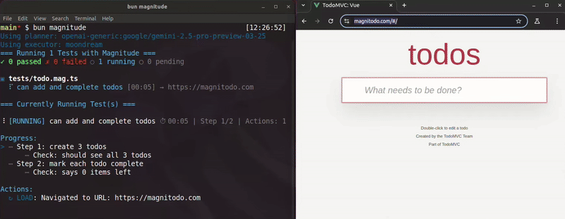

<div align="center">
  <p>
    
  </p>

  <h3 align="center">
    Magnitude: Robust AI web testing framework
  </h3>

  <p>
    <a href="https://discord.gg/VcdpMh9tTy" target="_blank"></a> <a href="https://magnitude.run/" target="_blank"></a> <a href="https://docs.magnitude.run/getting-started/introduction" target="_blank"></a>  <a href="https://x.com/tgrnwld" target="_blank"></a> <a href="https://x.com/ndrsrkl" target="_blank"></a>
  </p>

  <hr style="height: 1px; border: none; background-color: #e1e4e8; margin: 24px 0;">
</div>

End-to-end testing framework powered by visual AI agents that see your interface and adapt to any changes in it.

Available as a [hosted service](#how-to-run-your-first-test) or you can [self-host](#self-hosting) since we're open source!

## How it works
- ✍️ Build test cases easily with natural language
- 🧠 Strong reasoning agent to plan and adjust tests
- 👁️ Fast visual agent to reliably execute runs
- 📄 Plan is saved to execute runs the same way
- 🛠 Reasoning agent steps in if there is a problem
- 🏃‍♂️ Run tests locally or in CI/CD pipelines



↕️ Magnitude test case in action! ↕️
```ts
test('can log in and create company')
    .step('Log in to the app')
        .data({ username: 'test-user@magnitude.run' }) // arbitrary key/values
        .secureData({ password: 'test' }) // sensitive data
        .check('Can see dashboard') // natural language assertion
    .step('Create a new company')
        .data('Make up the first 2 values and use defaults for the rest')
        .check('Company added successfully');
```

## Running your first test

**1. Install our test runner** in the node project you want to test (or see our [demo repo](https://github.com/magnitudedev/magnitude-demo-repo) if you don't have a project to try it on)
```sh
npm install --save-dev magnitude-test
```

**2. Setup Magnitude** in your project by running:
```sh
npx magnitude init
```
This will create a basic tests directory `tests/magnitude` with:
- `magnitude.config.ts`: Magnitude test configuration file
- `example.mag.ts`: An example test file

**3. Configure the Magnitude client**

For hosted, you just need a Magnitude API key. To use your own LLM providers and browser infra, see [self-hosting](#self-hosting).

You can get a free API key by signing up at <a href="https://app.magnitude.run/signup" target="_blank">app.magnitude.run/signup</a> in Settings -> API Keys. Then set the `MAGNITUDE_API_KEY` environment variable:
```sh
export MAGNITUDE_API_KEY=<your-api-key-here>
```

**4. Run your Magnitude tests with:**
```sh
npx magnitude
```

This will run all Magnitude test files discovered with the `*.mag.ts` pattern. Click the URL that pops up to view the test in the Magnitude dashboard! For more information see docs on [running tests](https://docs.magnitude.run/core-concepts/running-tests) or [CLI reference](https://docs.magnitude.run/reference/cli).

**5. Add your own test cases!**

Now that you've got Magnitude set up, you can create real test cases for your app. Here's an example for a general idea:
```ts
import { test } from 'magnitude-test';

test('can log in and create company')
    .step('Log in to the app')
        .data({ username: 'test-user@magnitude.run' }) // arbitrary key/values
        .secureData({ password: 'test' }) // sensitive data
        .check('Can see dashboard') // natural language assertion
    .step('Create a new company')
        .data('Make up the first 2 values and use defaults for the rest')
        .check('Company added successfully');
```

Steps, checks, and data are all natural language. Think of it like you're describing how to test a particular flow to a co-worker - what steps they need to take, what they should check for, and what test data to use.

For more information on how to build test cases see <a href="https://docs.magnitude.run/core-concepts/building-test-cases" target="_blank">our docs.</a>


## Self-hosting

To run Magnitude without using our hosted option, you will need:
- Playwright and chromium installed in the environment where tests are running
  - In staging environments, installing a virtual display server like `xvfb` may also be necessary to run browsers properly in headful mode
- An Anthropic API key
- A self-hosted deployment of <a href="https://huggingface.co/allenai/Molmo-7B-D-0924" target="_blank">Molmo 7B</a> (we are working with providers to get this available as an inference endpoint ASAP!)

### Playwright setup
The Magnitude test runner has `playwright` as an optional peer dependency when you're self-hosting and running browsers locally.
Install it in the same project as `magnitude-test`:
```sh
npm install playwright
```
You will also need to run `npx playwright install` and ensure browsers are installed correctly.

For staging or containerized environments, you may need to also install and run a virtual display server like `xvfb` since Magnitude runs browsers in headful mode.

### LLM configuration
Magnitude relies on two LLM models to plan and execute test cases:
1. A larger model for planning and reasoning ("planner")
2. A smaller, fast, vision capable model with pixel-perfect accuracy ("executor")

For the planner model, we strongly recommend Anthropic's Sonnet 3.5 or 3.7. To get an Anthropic API key, go to <a href="https://console.anthropic.com" target="_blank">Anthropic Console</a>, then set it as an environment variable:
```
export ANTHROPIC_API_KEY=<your-anthropic-api-key>
```

For the executor model, currently the only compatible models are the Molmo models by Allen AI. Specifically we recommend <a href="https://huggingface.co/allenai/Molmo-7B-D-0924" target="_blank">Molmo-7B-D</a> . Currently this model is not available through any providers, so you will need to self-host it. We recommend doing so with <a href="https://modal.com" target="_blank">Modal</a>. To deploy Molmo with Modal see [Deploying Molmo](infra/modal). Once deployed configure these environment variables:
```sh
export MOLMO_VLLM_BASE_URL="https://<your-modal-username>--molmo-vllm-serve.modal.run/v1"
export MOLMO_VLLM_API_KEY=<your-anthropic-api-key>
```

### Running in self-hosted mode

Once everything is configured properly, you can run your tests using the same test runner, just pass the `-l/--local` flag:
```
npx magnitude -l
```
This will use your local **Playwright** installation, **ANTHROPIC_API_KEY**, **MOLMO_URL**, and **MOLMO_API_KEY** instead of the **MAGNITUDE_API_KEY** and remote agent.

## Self-hosted vs. Hosted

| Feature | Self-hosted | Hosted |
| --- | --- | --- |
| 🧪 Test framework (run AI tests anywhere!) | ✅ | ✅ |
| 🤖 Core agents (fully open source!) | ✅ | ✅ |
| 🌐 Managed browser infra (no Playwright needed!) | ❌ | ✅ |
| 🧠 Managed LLM infra (only need Magnitude API key!) | ❌ | ✅ |
| 🎮 Test playground (design and debug tests visually!) | ❌ | ✅ |
| 📊 Test Console (manage test cases + view past runs!) | ❌ | ✅ |
| 💸 Free tier + per-run <a href="https://magnitude.run/pricing" target="_blank">pricing</a> (simple + affordable!)  | ❌ | ✅ |

## FAQ

### Why not OpenAI Operator / Claude Computer Use?
We use separate planning / execution models in order to plan effective tests while executing them quickly and reliably. OpenAI or Anthropic's Computer Use APIs are better suited to general purpose desktop/web tasks but lack the speed, reliability, and cost-effectiveness for running test cases. Magnitude's agent is designed from the ground up to plan and execute test cases, and provides a native test runner purpose-built for designing and running these tests.

## Contact

To get a personalized demo or see how Magnitude can help your company, feel free to reach out to us at founders@magnitude.run

You can also join our <a href="https://discord.gg/VcdpMh9tTy" target="_blank">Discord community</a> for help or any suggestions!
